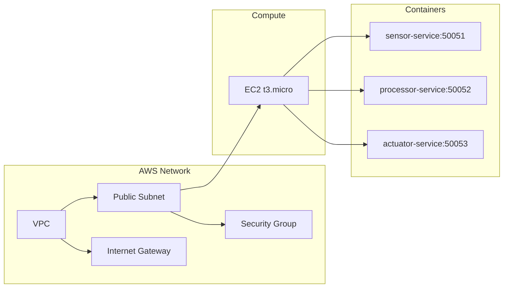

# Relatório Técnico

## 1. Introdução e Motivação

Neste trabalho, projetamos e implementamos um sistema distribuído simulado de pipeline de sensores, processamento e atuadores, aplicando conceitos de computação em nuvem e comunicação moderna entre processos. A motivação é aprofundar tópicos de sistemas distribuídos, infraestrutura como código e comunicação eficiente, usando:

* **AWS CloudFormation** e **Terraform** para provisionamento de infraestrutura.
* **gRPC** para comunicação entre microserviços.
* **Docker** para empacotamento e execução dos serviços.

O cenário simula IoT/data pipeline: um **Sensor** gera leituras de temperatura, um **Processor** calcula médias cumulativas e um **Actuator** decide ações com base nessas médias. Isso permite demonstrar streaming gRPC, paralelismo, contêineres, IaC e testes de carga.

## 2. Arquitetura Proposta

### 2.1 Diagrama de Alto Nível



* **VPC**: rede privada AWS com CIDR `10.0.0.0/16`.
* **Sub-rede Pública**: CIDR `10.0.1.0/24`, com IP público atribuído.
* **Internet Gateway**: permite acesso à Internet.
* **Security Group**: libera portas 22 (SSH) e 50051–50053 (gRPC).
* **EC2 t3.micro**: instância compute para rodar containers.
* **Docker** instalado via `user_data`, executando os três serviços gRPC.

> Observação: escalabilidade futura pode usar ECS/EKS ou Auto Scaling Groups e Load Balancer.

## 3. Justificativa das Escolhas Tecnológicas

* **Infraestrutura como Código**:

  * *CloudFormation* para redes (VPC, Sub-rede, IGW, Route Table, SG).
  * *Terraform* para compute (EC2), usando outputs do CloudFormation e configurando IAM Roles.
* **Docker**: empacota dependências e ambiente de execução isolado para cada serviço.
* **gRPC**: comunicação eficiente via Protobuf, com suporte a streaming e geração de stubs em múltiplas linguagens.
* **IAM Role + Instance Profile**: permite à EC2 autenticar no ECR para pull das imagens sem credenciais manuais.
* **AWS CLI** no `user_data`: automatiza login no ECR e pull das imagens ao inicializar a instância.

Temas usados: Arquitetura de Nuvem, IaC (CloudFormation, Terraform), gRPC, Docker, Paralelismo (ThreadPoolExecutor), Contêineres, Comunicação entre processos.

## 4. Infraestrutura como Código

### 4.1 CloudFormation: `network.yaml`

Principais trechos:

```yaml
AWSTemplateFormatVersion: '2010-09-09'
Description: Rede VPC com Sub-rede Pública e Security Group para gRPC

Parameters:
  EnvironmentName:
    Type: String
    Default: dev

Resources:
  VPC:
    Type: AWS::EC2::VPC
    Properties:
      CidrBlock: 10.0.0.0/16
      Tags:
        - Key: Name
          Value: !Sub '${EnvironmentName}-vpc'

  PublicSubnet1:
    Type: AWS::EC2::Subnet
    Properties:
      VpcId: !Ref VPC
      CidrBlock: 10.0.1.0/24
      MapPublicIpOnLaunch: true
      Tags:
        - Key: Name
          Value: !Sub '${EnvironmentName}-public-subnet'

  InternetGateway:
    Type: AWS::EC2::InternetGateway
    Properties:
      Tags:
        - Key: Name
          Value: !Sub '${EnvironmentName}-igw'
  AttachGateway:
    Type: AWS::EC2::VPCGatewayAttachment
    Properties:
      VpcId: !Ref VPC
      InternetGatewayId: !Ref InternetGateway

  PublicRouteTable:
    Type: AWS::EC2::RouteTable
    Properties:
      VpcId: !Ref VPC
      Tags:
        - Key: Name
          Value: !Sub '${EnvironmentName}-public-rt'
  PublicRoute:
    Type: AWS::EC2::Route
    Properties:
      RouteTableId: !Ref PublicRouteTable
      DestinationCidrBlock: 0.0.0.0/0
      GatewayId: !Ref InternetGateway
  SubnetRouteTableAssociation:
    Type: AWS::EC2::SubnetRouteTableAssociation
    Properties:
      SubnetId: !Ref PublicSubnet1
      RouteTableId: !Ref PublicRouteTable

  InstanceSecurityGroup:
    Type: AWS::EC2::SecurityGroup
    Properties:
      GroupDescription: "SG para SSH e gRPC"
      VpcId: !Ref VPC
      SecurityGroupIngress:
        - IpProtocol: tcp
          FromPort: 22
          ToPort: 22
          CidrIp: 0.0.0.0/0
        - IpProtocol: tcp
          FromPort: 50051
          ToPort: 50053
          CidrIp: 0.0.0.0/0

Outputs:
  VpcId:
    Description: ID da VPC
    Value: !Ref VPC
    Export:
      Name: !Sub '${EnvironmentName}-VpcId'
  PublicSubnetId:
    Description: ID da Sub-rede Pública
    Value: !Ref PublicSubnet1
    Export:
      Name: !Sub '${EnvironmentName}-PublicSubnetId'
  SecurityGroupId:
    Description: Security Group para instâncias
    Value: !Ref InstanceSecurityGroup
    Export:
      Name: !Sub '${EnvironmentName}-SecurityGroupId'
```

* Use `aws cloudformation deploy --stack-name network-stack --template-file network.yaml --parameter-overrides EnvironmentName=dev --capabilities CAPABILITY_NAMED_IAM --region us-east-2`.
* Outputs exportam IDs para uso no Terraform.

### 4.2 Terraform: `variables.tf`, `main.tf`, `outputs.tf`

#### `variables.tf`

```hcl
variable "aws_region" {
  description = "Região AWS"
  type        = string
  default     = "us-east-2"
}
variable "network_stack_name" {
  description = "Nome do stack CloudFormation"
  type        = string
  default     = "network-stack"
}
variable "instance_type" {
  description = "Tipo de instância EC2"
  type        = string
  default     = "t3.micro"
}
variable "key_name" {
  description = "Key Pair para SSH"
  type        = string
  default     = "minha-chave-ec2"
}
```

#### `main.tf`

```hcl
terraform {
  required_providers {
    aws = {
      source  = "hashicorp/aws"
      version = ">= 4.0"
    }
  }
}
provider "aws" {
  region = var.aws_region
}

# Lê o stack de rede criado pelo CloudFormation
data "aws_cloudformation_stack" "network" {
  name = var.network_stack_name
}

# Busca a AMI Amazon Linux 2 mais recente\data "aws_ami" "amazon_linux_2" {
  most_recent = true
  owners      = ["amazon"]
  filter {
    name   = "name"
    values = ["amzn2-ami-hvm-*-x86_64-gp2"]
  }
}

# IAM Role para permitir pull no ECR
resource "aws_iam_role" "ec2_ecr_role" {
  name = "ec2-ecr-role"
  assume_role_policy = <<POLICY
{
  "Version": "2012-10-17",
  "Statement": [{
    "Effect": "Allow",
    "Principal": {"Service": "ec2.amazonaws.com"},
    "Action": "sts:AssumeRole"
  }]
}
POLICY
}
resource "aws_iam_role_policy_attachment" "ec2_ecr_attach" {
  role       = aws_iam_role.ec2_ecr_role.name
  policy_arn = "arn:aws:iam::aws:policy/AmazonEC2ContainerRegistryReadOnly"
}
resource "aws_iam_instance_profile" "ec2_ecr_profile" {
  name = "ec2-ecr-profile"
  role = aws_iam_role.ec2_ecr_role.name
}

# Instância EC2 para rodar containers gRPC
resource "aws_instance" "app_server" {
  ami                    = data.aws_ami.amazon_linux_2.id
  instance_type          = var.instance_type
  subnet_id              = data.aws_cloudformation_stack.network.outputs["PublicSubnetId"]
  vpc_security_group_ids = [data.aws_cloudformation_stack.network.outputs["SecurityGroupId"]]
  key_name               = var.key_name
  iam_instance_profile   = aws_iam_instance_profile.ec2_ecr_profile.name

  user_data = <<-EOF
    #!/bin/bash
    set -eux

    # Atualiza e instala Docker
    yum update -y
    amazon-linux-extras install docker -y
    systemctl enable --now docker

    # Instala AWS CLI v2
    yum install -y unzip
    curl "https://awscli.amazonaws.com/awscli-exe-linux-x86_64.zip" -o "/tmp/awscliv2.zip"
    unzip /tmp/awscliv2.zip -d /tmp
    /tmp/aws/install

    # Autentica no ECR e executa containers
    aws ecr get-login-password --region ${var.aws_region} | docker login --username AWS --password-stdin 653447836976.dkr.ecr.${var.aws_region}.amazonaws.com
    docker run -d --name sensor_service   -p 50051:50051 653447836976.dkr.ecr.${var.aws_region}.amazonaws.com/sensor-service:latest
    docker run -d --name processor_service -p 50052:50052 653447836976.dkr.ecr.${var.aws_region}.amazonaws.com/processor-service:latest
    docker run -d --name actuator_service  -p 50053:50053 653447836976.dkr.ecr.${var.aws_region}.amazonaws.com/actuator-service:latest
  EOF

  tags = {
    Name = "app-server"
  }
}
```

#### `outputs.tf`

```hcl
output "app_server_public_ip" {
  description = "IP público da EC2"
  value       = aws_instance.app_server.public_ip
}
output "app_server_id" {
  description = "ID da EC2"
  value       = aws_instance.app_server.id
}
```

## 5. Comunicação entre Componentes

1. **Sensor Service**

   * Proto: define `ReadingRequest { string sensor_id }` e `Temperature { sensor_id, value, timestamp }`.
   * Método: `rpc StreamReadings(ReadingRequest) returns (stream Temperature)`.
   * Gera leituras simuladas a cada segundo.

2. **Processor Service**

   * Proto: recebe stream `Temperature`, retorna stream `ProcessedData { sensor_id, average, timestamp }`.
   * Método: `rpc ProcessReadings(stream Temperature) returns (stream ProcessedData)`.
   * Calcula média cumulativa e envia a cada nova leitura.

3. **Actuator Service**

   * Proto: define `ActuationCommand { sensor_id, average, timestamp, turn_on }`.
   * Método: `rpc Execute(stream ActuationCommand) returns (stream ActuationCommand)`.
   * Recebe médias, decide `turn_on` se average > 25.

4. **Fluxo de teste**

   1. Cliente conecta ao Sensor, gera `reads.json`.
   2. Cliente envia `reads.json` ao Processor, gera `processed.json`.
   3. Cliente envia `processed.json` ao Actuator, gera `actuator_out.json`.

   * Usa `grpcurl` local ou script Python para orquestrar.

## 6. Paralelismo e Escalabilidade

* Cada servidor gRPC Python usa `ThreadPoolExecutor(max_workers=10)` para atender múltiplas conexões simultâneas.
* Containers isolados permitem replicação em múltiplas instâncias futuras.
* Estratégias futuras: ECS/EKS ou Auto Scaling Group com Load Balancer, Message Broker para desacoplamento, monitoramento.

## 7. Testes

### 7.1 Testes Funcionais

* **Local**: Docker Compose e `grpcurl`, confirmando endpoints e fluxos.
* **Na nuvem**: `grpcurl` do laptop para IP público da EC2.

### 7.2 Testes de Carga

* Script que abre N conexões simultâneas ao Sensor, mede tempo de resposta e uso de CPU.
* Em EC2 t3.micro, recomendável não exceder 5 conexões simultâneas para evitar latência alta.

### 7.3 Testes de Falha

* Parar/reiniciar containers para verificar recuperação manual.
* Logs de erro avaliados via `docker logs` e `cloud-init-output.log`.

## 8. Considerações Finais e Melhorias

* Solução funcional para protótipo; instância única é ponto de falha.
* Melhorias: uso de ECS/EKS, Auto Scaling, Load Balancer, TLS em gRPC, Message Broker (RabbitMQ/Kafka), monitoramento avançado (Prometheus/Grafana), CI/CD completo.

## 9. Scripts de Build/Deploy

### 9.1 Dockerfiles

* **sensor/Dockerfile**

  ```dockerfile
  FROM python:3.9-slim
  WORKDIR /app
  COPY requirements.txt ./
  RUN pip install --no-cache-dir -r requirements.txt
  COPY . .
  EXPOSE 50051
  CMD ["python3", "sensor_server.py"]
  ```

* **processor/Dockerfile**

  ```dockerfile
  FROM python:3.9-slim
  WORKDIR /app
  COPY requirements.txt ./
  RUN pip install --no-cache-dir -r requirements.txt
  COPY . .
  EXPOSE 50052
  CMD ["python3", "processor_server.py"]
  ```

* **actuator/Dockerfile**

  ```dockerfile
  FROM python:3.9-slim
  WORKDIR /app
  COPY requirements.txt ./
  RUN pip install --no-cache-dir -r requirements.txt
  COPY . .
  EXPOSE 50053
  CMD ["python3", "actuator_server.py"]
  ```

### 9.2 Script de Build e Push: `deploy/build_and_push.sh`

```bash
#!/usr/bin/env bash
set -eux
REGION="us-east-2"
ACCOUNT_ID="653447836976"
ECR_URL="${ACCOUNT_ID}.dkr.ecr.${REGION}.amazonaws.com"

# Login no ECR
aws ecr get-login-password --region ${REGION} | docker login --username AWS --password-stdin ${ECR_URL}

# Build e Push Sensor
docker buildx build --platform linux/amd64 --push -t ${ECR_URL}/sensor-service:latest ./sensor

# Build e Push Processor
docker buildx build --platform linux/amd64 --push -t ${ECR_URL}/processor-service:latest ./processor

# Build e Push Actuator
docker buildx build --platform linux/amd64 --push -t ${ECR_URL}/actuator-service:latest ./actuator
```

> Torne executável: `chmod +x deploy/build_and_push.sh`

### 9.3 Scripts de Deploy Infra

* **deploy/deploy\_cf.sh**

  ```bash
  #!/usr/bin/env bash
  set -eux
  REGION="us-east-2"
  aws cloudformation deploy \
    --stack-name network-stack \
    --template-file network.yaml \
    --parameter-overrides EnvironmentName=prod \
    --capabilities CAPABILITY_NAMED_IAM \
    --region ${REGION}
  ```

  > Torne executável: `chmod +x deploy/deploy_cf.sh`

* **deploy/deploy\_tf.sh**

  ```bash
  #!/usr/bin/env bash
  set -eux
  cd terraform
  terraform init
  terraform apply -auto-approve
  ```

  > Torne executável: `chmod +x deploy/deploy_tf.sh`

## 10. README: Instruções de Execução

### 10.1 Requisitos

* Docker (com Buildx) instalado localmente.
* AWS CLI v2 configurado com credenciais adequadas.
* Terraform CLI instalado.
* Python 3.9+ com `grpcio`, `grpcio-tools`, `protobuf`.
* `grpcurl` instalado para testes gRPC.

### 10.2 Estrutura do Projeto

```
/project-root
├── network.yaml
├── terraform
│   ├── variables.tf
│   ├── main.tf
│   └── outputs.tf
├── sensor
│   ├── Dockerfile
│   ├── requirements.txt
│   ├── sensor.proto
│   └── sensor_server.py
├── processor
│   ├── Dockerfile
│   ├── requirements.txt
│   ├── processor.proto
│   └── processor_server.py
├── actuator
│   ├── Dockerfile
│   ├── requirements.txt
│   ├── actuator.proto
│   └── actuator_server.py
├── deploy
│   ├── build_and_push.sh
│   ├── deploy_cf.sh
│   └── deploy_tf.sh
├── scripts
│   └── test_grpc.sh
├── README.md
└── relatorio_tecnico.md
```

### 10.3 Execução Local

1. **Gerar stubs gRPC**:

   ```bash
   cd sensor
   python3 -m grpc_tools.protoc -I. --python_out=. --grpc_python_out=. sensor.proto
   cd ../processor
   python3 -m grpc_tools.protoc -I. --python_out=. --grpc_python_out=. processor.proto
   cd ../actuator
   python3 -m grpc_tools.protoc -I. --python_out=. --grpc_python_out=. actuator.proto
   cd ..
   ```
2. **Build e Run**:

   * Com Docker Compose: crie `docker-compose.yml` conforme exemplo e execute `docker-compose up --build -d`.
   * Ou manualmente:

     ```bash
     docker build -t sensor-service ./sensor
     docker run -d --name sensor_service -p 50051:50051 sensor-service
     docker build -t processor-service ./processor
     docker run -d --name processor_service -p 50052:50052 processor-service
     docker build -t actuator-service ./actuator
     docker run -d --name actuator_service -p 50053:50053 actuator-service
     ```
3. **Testes locais**:

   ```bash
   grpcurl -plaintext -import-path ./sensor -proto sensor/sensor.proto -d '{"sensor_id":"s1"}' localhost:50051 sensor.Sensor/StreamReadings > reads.json
   grpcurl -plaintext -import-path ./processor -proto processor/processor.proto -d @ localhost:50052 processor.Processor/ProcessReadings < reads.json > processed.json
   grpcurl -plaintext -import-path ./actuator -proto actuator/actuator.proto -d @ localhost:50053 actuator.Actuator/Execute < processed.json > actuator_out.json
   cat actuator_out.json
   ```

### 10.4 Publicar Imagens no ECR

1. **Login**:

   ```bash
   aws ecr get-login-password --region us-east-2 | docker login --username AWS --password-stdin 653447836976.dkr.ecr.us-east-2.amazonaws.com
   ```
2. **Build e Push**:

   ```bash
   ./deploy/build_and_push.sh
   ```

### 10.5 Deploy em Nuvem

1. **Rede**:

   ```bash
   ./deploy/deploy_cf.sh
   ```
2. **Compute**:

   ```bash
   ./deploy/deploy_tf.sh
   ```
3. **Obter IP**:

   ```bash
   terraform output app_server_public_ip
   ```
4. **Testar gRPC**:

   ```bash
   grpcurl -plaintext -import-path ./sensor -proto sensor/sensor.proto -d '{"sensor_id":"s1"}' <IP>:50051 sensor.Sensor/StreamReadings
   ```
5. **SSH**:

   ```bash
   ssh -i ~/.ssh/minha-chave-ec2.pem ec2-user@<IP>
   sudo docker ps; sudo docker logs sensor_service
   ```

### 10.6 Teardown

```bash
terraform destroy -auto-approve
aws cloudformation delete-stack --stack-name network-stack --region us-east-2
```

---

Este relatório e README foram revisados para alinhamento e consistência de formatação. Ajuste valores específicos conforme seu ambiente. Se precisar de novas revisões, me avise!

> **Referências**:
> * CHATGPT-4.0 consulta de doc e auxilio no codgo e gerar o relatorio [https://chatgpt.com/](https://chatgpt.com/)
> * AWS CloudFormation Docs: [https://docs.aws.amazon.com/cloudformation/](https://docs.aws.amazon.com/cloudformation/)
> * Terraform AWS Provider: [https://registry.terraform.io/providers/hashicorp/aws/latest](https://registry.terraform.io/providers/hashicorp/aws/latest)
> * gRPC Python: [https://grpc.io/docs/languages/python/](https://grpc.io/docs/languages/python/)
> * Docker Documentation: [https://docs.docker.com/](https://docs.docker.com/)
> * AWS ECR Authentication: [https://docs.aws.amazon.com/AmazonECR/latest/userguide/Registries.html](https://docs.aws.amazon.com/AmazonECR/latest/userguide/Registries.html)
